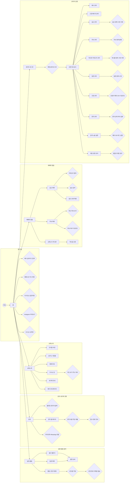

```mermaid
flowchart LR

  subgraph s1 ["홈·진입"]
    n1(("진입"))
    n2["홈"]
    n3{"배너 슬라이드 탐색"}
    n4{"예배시간 카드 확인"}
    n5{"다가오는 일정 확인"}
    n6{"Instagram 미리보기"}
    n7{"오시는 길 확인"}
  end

  subgraph s2 ["교회소개"]
    n8["교회소개"]
    n9["인사말·비전"]
    n10["섬기는 사람들"]
    n11["예배 안내"]
    n12["오시는 길"]
    n13{"지도 보기·주소 복사"}
    n14["새가족 안내"]
    n15["영어 안내 페이지"]
  end

  subgraph s3 ["예배와 말씀"]
    n16["예배와 말씀"]
    n17["설교 목록"]
    n18{"카테고리 필터"}
    n19{"설교 검색"}
    n20["설교 상세·재생"]
    n21["주보 목록"]
    n22{"최신 주보 보기"}
    n23{"주보 PDF 다운로드"}
    n24["교회소식 게시판"]
    n25["게시글 상세"]
  end

  subgraph s4 ["일정·활동 참여"]
    n26["일정·활동"]
    n27["월간 캘린더"]
    n28["일정 목록"]
    n29["일정 상세"]
    n30["활동 신청 이벤트"]
    n31{"신청 폼 작성"}
    n32{"신청 완료·이메일 발송"}
  end

  subgraph s5 ["문의·새가족 전환"]
    n33["문의"]
    n34{"플로팅 문의 톡 클릭"}
    n35["문의 폼 페이지"]
    n36{"문의 내용 작성·제출"}
    n37{"접수 완료 안내"}
    n38{"카카오톡·WhatsApp 연결"}
  end

  subgraph s6 ["관리자 운영"]
    n39["관리자 로그인"]
    n40{"계정 입력·로그인"}
    n41["운영 대시보드"]
    n42["배너 관리"]
    n43["고정 페이지 관리"]
    n44["설교 관리"]
    n45{"설교 등록·수정·삭제"}
    n46["주보 관리"]
    n47{"주보 등록·발행"}
    n48["게시판·카테고리 관리"]
    n49{"게시물 등록·수정·삭제"}
    n50["일정 관리"]
    n51{"일정 등록·수정"}
    n52["신청 관리"]
    n53{"신청자 목록·CSV 다운로드"}
    n54["문의 관리"]
    n55{"문의 상태 처리·답변"}
    n56["검색 노출 설정"]
    n57{"메타·OG 태그 설정"}
    n58["계정·권한 관리"]
    n59{"편집자 계정 관리"}
  end

  n1 --> n2
  n2 --> n3
  n2 --> n4
  n2 --> n5
  n2 --> n6
  n2 --> n7
  n2 --> n8
  n2 --> n16
  n2 --> n26
  n2 --> n33
  n2 --> n39
  n8 --> n9
  n8 --> n10
  n8 --> n11
  n8 --> n12
  n12 --> n13
  n8 --> n14
  n8 --> n15
  n16 --> n17
  n17 --> n18
  n17 --> n19
  n17 --> n20
  n16 --> n21
  n21 --> n22
  n21 --> n23
  n16 --> n24
  n24 --> n25
  n26 --> n27
  n26 --> n28
  n27 --> n29
  n28 --> n29
  n26 --> n30
  n30 --> n31
  n31 --> n32
  n33 --> n34
  n33 --> n35
  n35 --> n36
  n36 --> n37
  n33 --> n38
  n39 --> n40
  n40 --> n41
  n41 --> n42
  n41 --> n43
  n41 --> n44
  n44 --> n45
  n41 --> n46
  n46 --> n47
  n41 --> n48
  n48 --> n49
  n41 --> n50
  n50 --> n51
  n41 --> n52
  n52 --> n53
  n41 --> n54
  n54 --> n55
  n41 --> n56
  n56 --> n57
  n41 --> n58
  n58 --> n59
```
